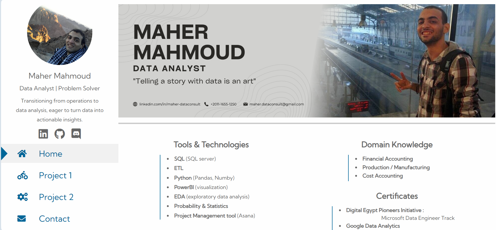

# 🌐 Maher Mahmoud's Portfolio

Welcome to my personal portfolio website! This site showcases my skills, projects, and experiences in the world of data analysis and beyond. Whether you're here to explore my work, connect with me, or just curious about what I do, you're in the right place.

## 🚀 About Me

I'm Maher Mahmoud, a passionate data analyst with a strong background in operations management. I've transitioned into data analysis to combine my analytical skills with my love for solving complex problems. My journey has equipped me with a solid foundation in SQL, data visualization, and statistical analysis, which I now leverage to extract valuable insights and drive decision-making processes.

## 🛠️ What You'll Find Here

- **Projects:** A collection of my key projects, demonstrating my expertise in data analysis, SQL, and data visualization. Each project includes a brief description, the tools and technologies used, and insights gained.
  
- **Skills:** An overview of my technical skills, including proficiency in SQL, Power BI, Excel, and other tools that I use to analyze and present data effectively.
  
- **Experience:** A summary of my professional background, highlighting my experience in operations management and how it informs my approach to data analysis.

- **Blog:** Insights, tutorials, and thoughts on data analysis, industry trends, and more. *(Optional: Include if you have a blog section on your site.)*

## 🎯 My Goals

I'm continuously learning and growing in the field of data analysis. My goals include:

- Mastering advanced data analysis techniques.
- Expanding my knowledge of machine learning and predictive modeling.
- Applying my skills to solve real-world problems and make a positive impact.

## 🧑‍💻 Let's Connect

I'm always open to networking and collaboration opportunities. Feel free to reach out to me through the contact form on my website or connect with me on LinkedIn.

**Portfolio URL:** [maher-dataconsult.github.io](https://maher-dataconsult.github.io)
